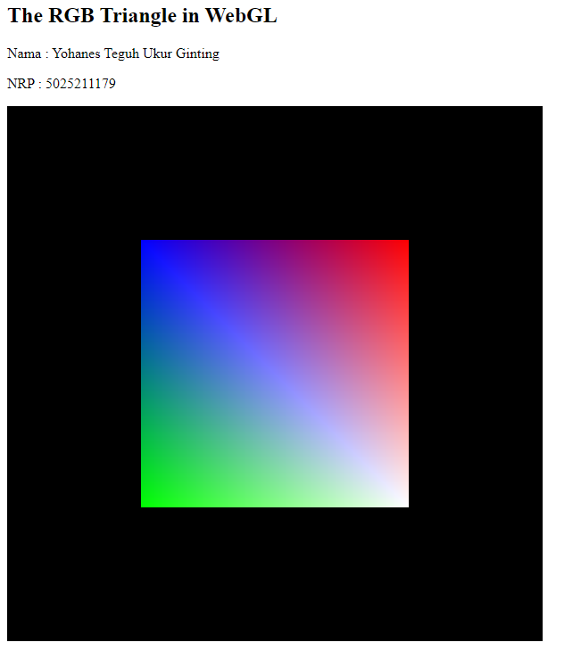

# Computer Graphic Task 3 - Computer Graphic - A
Name : Yohanes Teguh Ukur Ginting 
NRP : 5025211179

### Problem
- Drawing a 2-D square
- Show another side of the 3d cube

## Output
#### Drawing a 2-D square

#### Show another side of the 3d cube

